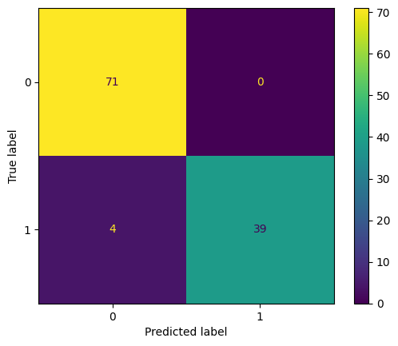

# Regressão Logistica para identificação de Câncer de Mama

Este projeto utiliza **regressão logística** para classificar tumores de mama como **malignos** ou **benignos**, com base em características extraídas de imagens de exames.
Há, além dos códigos do modelo um arquivo com explicações teóricas. No código também há comentários que tentam explicar cada parte do código. 

## Dataset

Utilizei o [Breast Cancer Wisconsin Diagnostic Dataset](https://archive.ics.uci.edu/dataset/17/breast+cancer+wisconsin+diagnostic), que contém 569 amostras, cada uma com 30 características numéricas derivadas de imagens digitais de biópsias de mama.

### Colunas utilizadas:
Foram selecionadas as **10 médias** principais:

- `radius_mean` Média do raio (distância do centro até a borda da célula)
- `texture_mean` Média da textura (variação na intensidade dos pixels)
- `perimeter_mean` Média do perímetro (contorno da célula)
- `area_mean` Média da área (tamanho da célula)
- `smoothness_mean` Média da suavidade (uniformidade das bordas)
- `compactness_mean` Média da compacidade (relação entre área e perímetro — quão "fechada" é a forma)
- `concavity_mean` Média da concavidade (grau de reentrância das bordas)
- `concave_points_mean` Média dos pontos côncavos (número de pontas reentrantes na borda)
- `symmetry_mean`  Média da simetria (quão simétrica é a célula)
- `fractal_dimension_mean` Média da dimensão fractal (medida da complexidade da forma da borda)

A coluna `diagnosis` foi usada como rótulo (`M` para maligno, `B` para benigno). Converti para `1` e `0` respectivamente.

---

## Modelo

- Algoritmo: `LogisticRegression` (da scikit-learn)
- Dados normalizados com `StandardScaler`
- Avaliação com `accuracy_score` e `ConfusionMatrixDisplay`
- Acurácia obtida: **~96.5%**

---
## Resultados

Um modelo simples como o produzirdo aqui (menos de 100 linhas) foi capaz de atingir acurácia de 96.49% O que é ótimo e demonstra o poder desse tipo de modelo.
A matriz de confusão a seguir demonstra:



---

## Como executar

1. Clone o repositório:
```bash
git clone https://github.com/Danielbgoncalves/logistic-regression-breast-cancer.git
cd logistic-regression-breast-cancer
```
2. Instale as dependências:
```bash 
pip install -r requirements.txt
```
3. Baixe também o arquivo `wdbc.data` no site da archive.ics.uci.edu

4. Execute o scrip principal:
```bash 
 python main.py
 ```

5. Ou ainda, use o jupiter notebook. O arquivo também está aqui no repositório

## Observações
Este projeto é didático e foi desenvolvido como prática de aprendizado de machine learning com dados reais.

Sinta-se à vontade para adaptar, melhorar e contribuir! 